# Unified Cam — Workflow Diagrams

ระบบจ่ายยาอัตโนมัติ ESP32-P4-Nano + กล้อง MIPI-CSI + จอสัมผัส + WiFi/MQTT/Telegram

> Diagrams ใช้ Mermaid syntax — render ได้ใน VS Code (พร้อม Markdown preview), GitHub, GitLab

---

## 1. Boot sequence

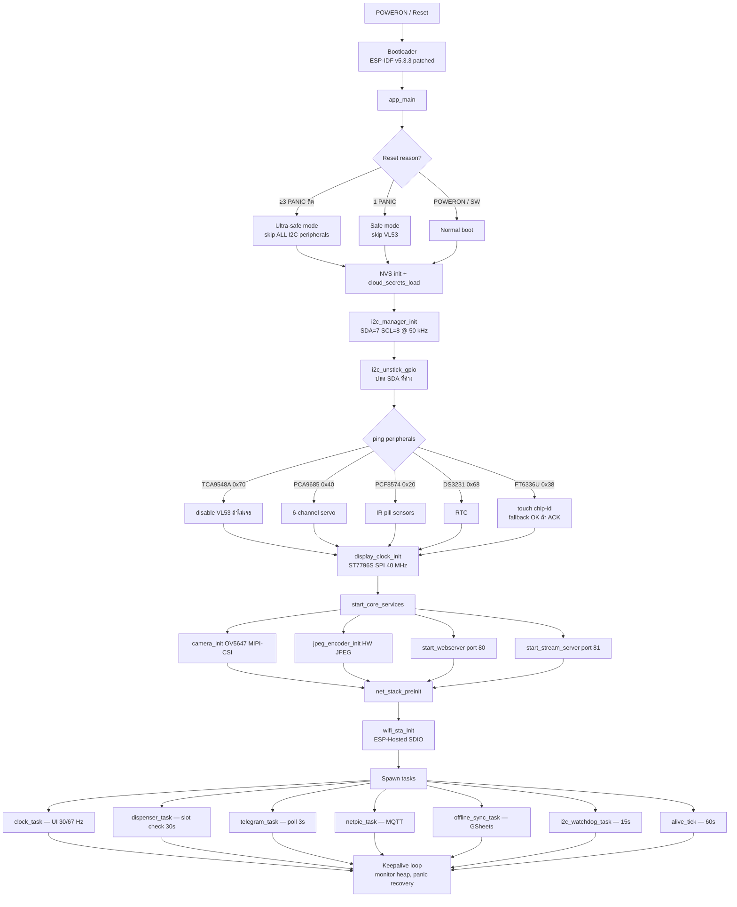

---

## 2. Dispense cycle timing (per pill, ~5.85 s)

```mermaid
gantt
    title One Dispense Cycle (~5.85 s)
    dateFormat  X
    axisFormat  %L ms

    section Servo
    go_work I2C cmd          :a1, 0, 10
    Servo at WORK position   :a2, after a1, 1490
    go_home I2C cmd          :a3, after a2, 10
    Servo returning HOME     :a4, after a3, 3990

    section IR polling
    Poll window 1 (1.5 s)    :crit, b1, 0, 1500
    Poll window 2 (4.0 s)    :crit, b2, 1500, 4000
    Settle pause (350 ms)    :b3, 5500, 350
    Final 8-sample jam check :crit, b4, 5850, 160
```

---

## 3. Manual dispense / return-all flow

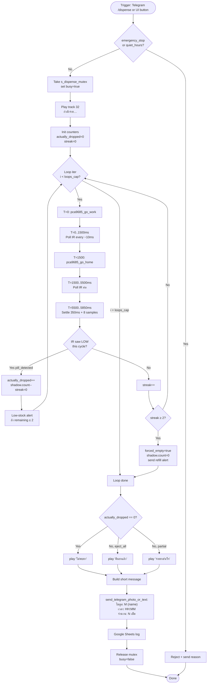

---

## 4. Scheduled dispense (จ่ายตามตาราง)

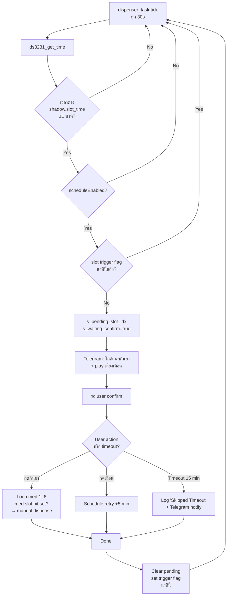

---

## 5. Touch input → UI state machine

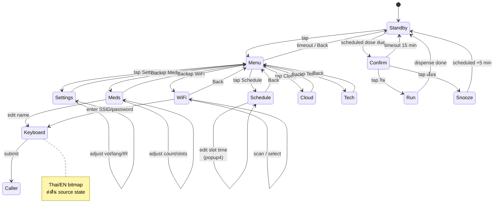

---

## 6. FT6336U touch read pipeline

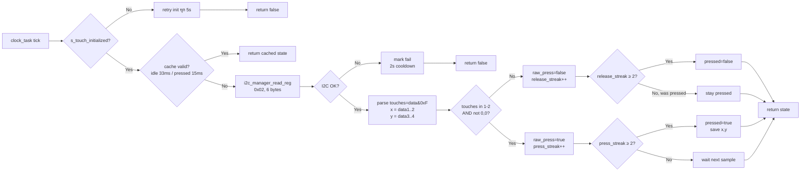

---

## 7. Cloud architecture

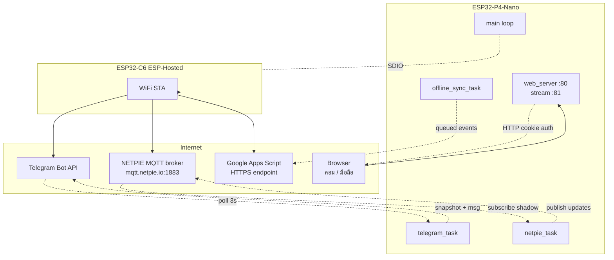

---

## 8. NETPIE shadow sync

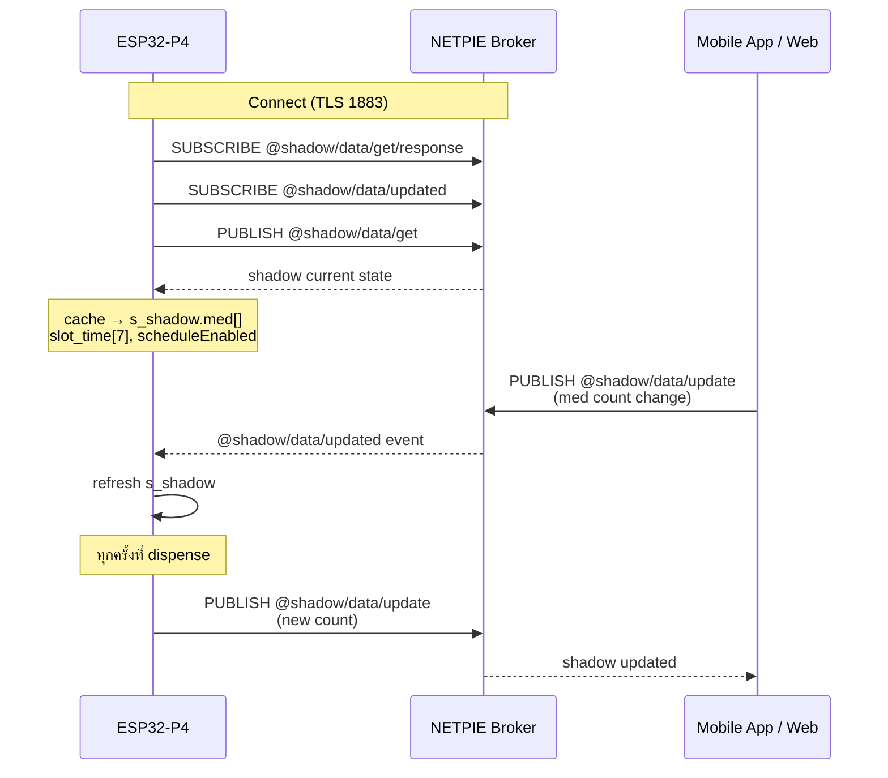

---

## 9. I2C watchdog & recovery

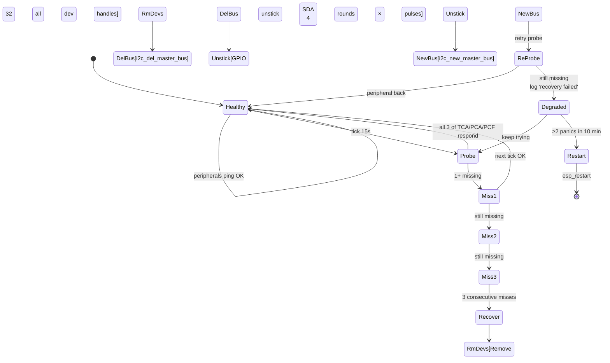

---

## 10. Hardware connection diagram

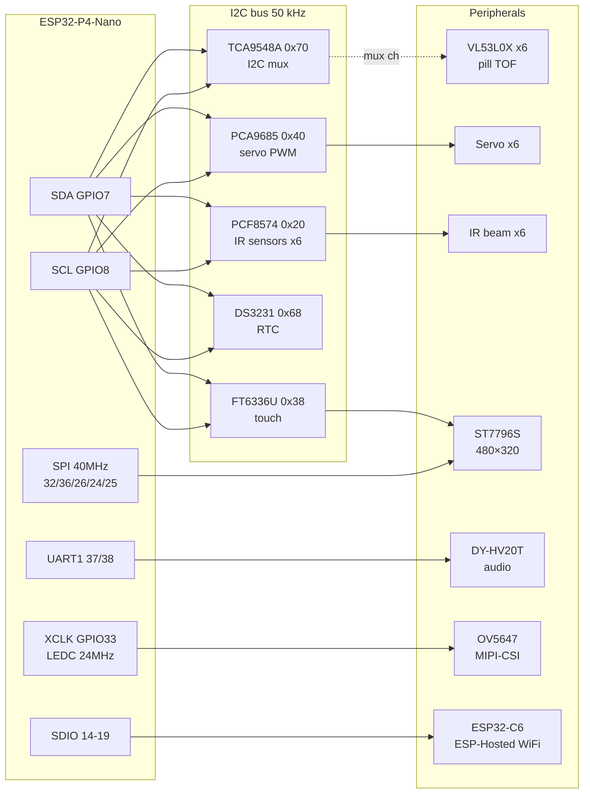

---

## 11. Build / flash workflow

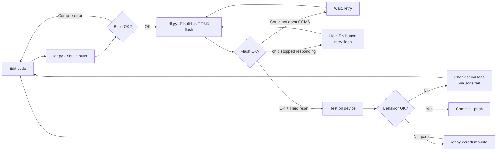

---

## 12. Telegram command map

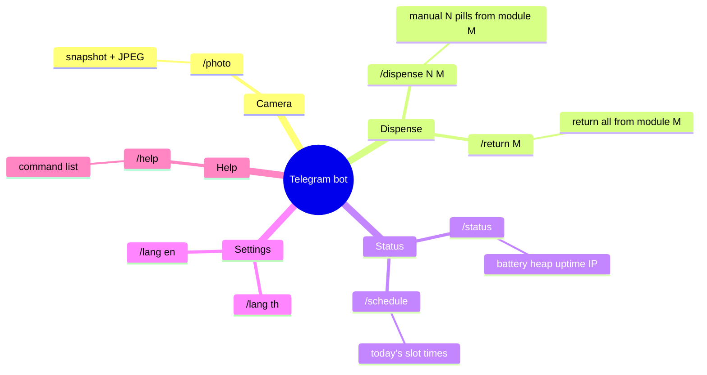

---

## 13. Logs / TAG quick reference

```mermaid
flowchart LR
    Boot[unified_cam] -.alive ticks 60s.-> Log[/logs/tail<br/>64 KB ring]
    I2C[i2c_mgr] -.bus init recovery.-> Log
    Disp[dispenser] -.Drop X/N events.-> Log
    Touch[FT6336U] -.touch state.-> Log
    Cam[camera_init / ov5647] -.frame timeout.-> Log
    WiFi[wifi_sta / RPC_WRAP / transport] -.connect events.-> Log
    Mqtt[netpie_mqtt] -.shadow sync.-> Log
    Tg[tg_poll / tg_text_wrk] -.bot commands.-> Log
    Log -.HTTP authenticated.-> User[Tech panel<br/>/tech → Logs tab]
```
